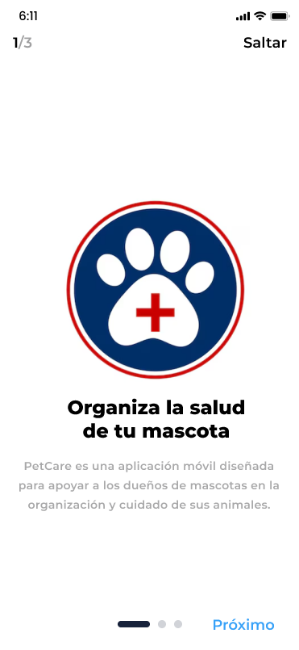
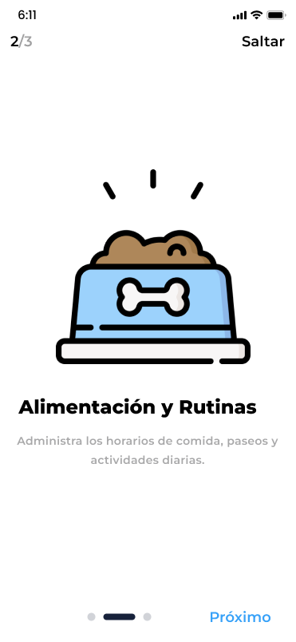
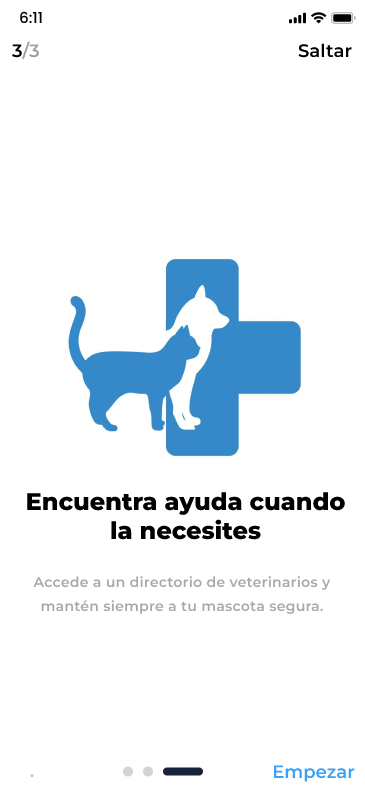
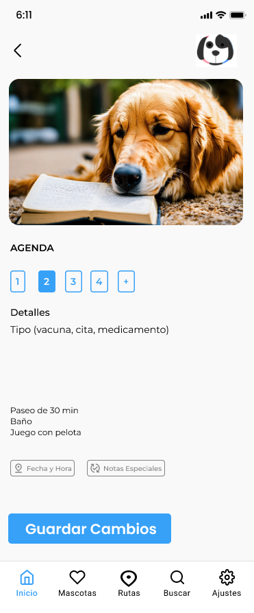
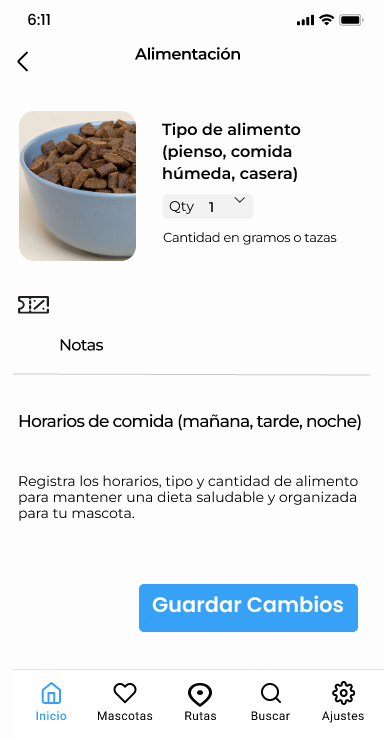
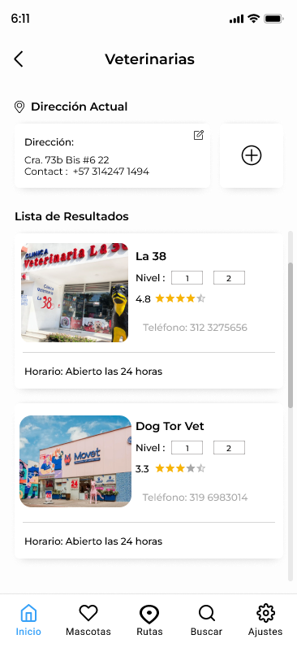

# Diseño de interfaz de usuario

La aplicación tendrá la siguientes pantallas

1. Pantalla 1: Pantalla Inicial

2. Pantalla 2: Informacion de la App

3. Pantalla 3: Informacion de la App

4. Pantalla 4: Informacion de la App

5. Pantalla 5: Ingresar con Credenciales ya Existentes

6. Pantalla 6: Crear Cuenta

7. Pantalla 7: Reestablecer Contraseña

8. Pantalla 8: Home de la App

9. Pantalla 9: Datos del Perfil

10. Pantalla 10: Recordatorios

11. Pantalla 11: Agenda

12. Pantalla 12: Control de Alimentacion

13. Pantalla 13: Veterinarias Cercanas

# Referencias

- [Material Design: Foundations](https://m3.material.io/foundations)
- [Material Design: Style](https://m3.material.io/styles)
- [Figma](https://www.figma.com/es-la/)
