# Diseño de interfaz de usuario

La aplicación tendrá la siguientes pantallas

1. Pantalla 1: Pantalla Inicial

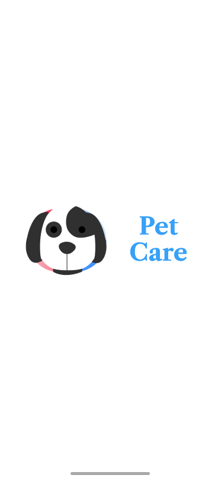

2. Pantalla 2: Ingresar con Credenciales ya Existentes

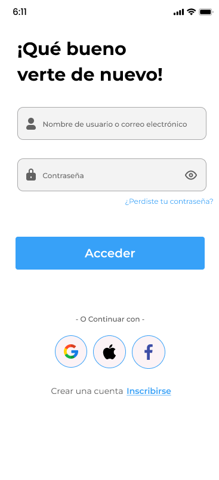

3. Pantalla 3: Crear Cuenta

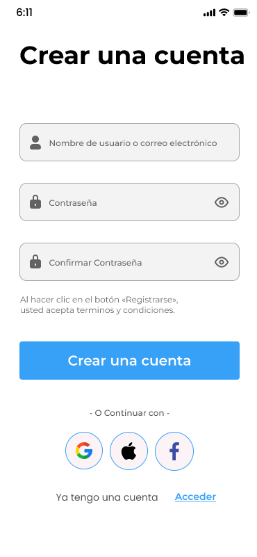

4. Pantalla 4: Reestablecer Contraseña

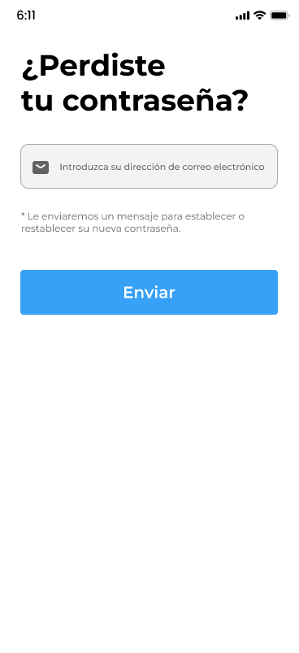

5. Pantalla 5: Home de la App

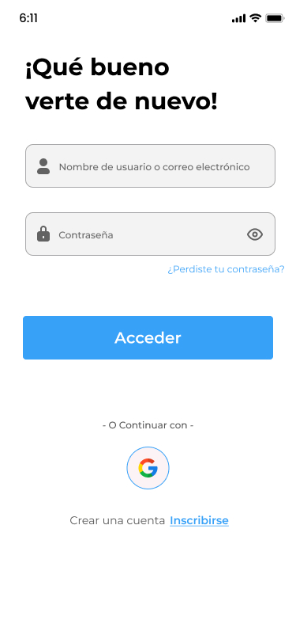

6. Pantalla 5: Artículo 1 (¿Como subirle las defensas a tu perro?)

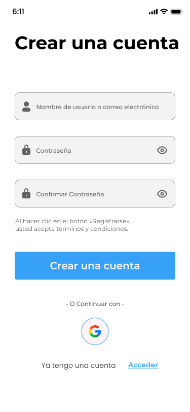

7. Pantalla 7: Artículo 2 (¿Rutinas de ejercicio y juegos recomendados para tu mascota?)

8. Pantalla 8: Artículo 3 (Higiene básica y cuidado del pelaje)

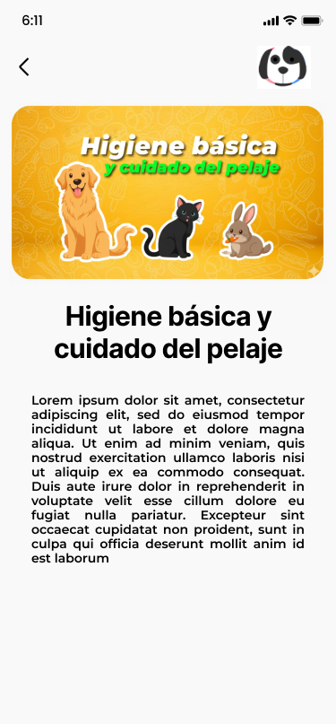

9. Pantalla 9: Datos del Perfil

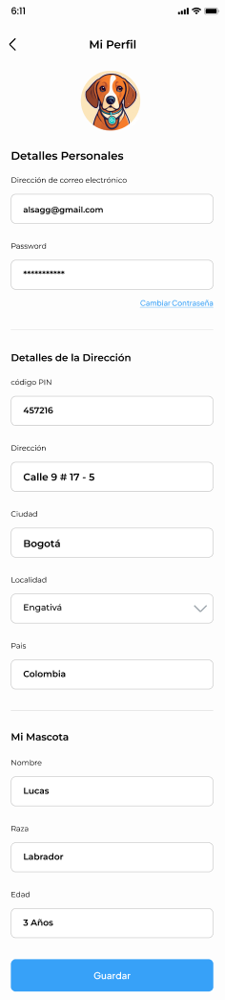

10. Pantalla 10: Recordatorios

11. Pantalla 11: Lista de recordatorios

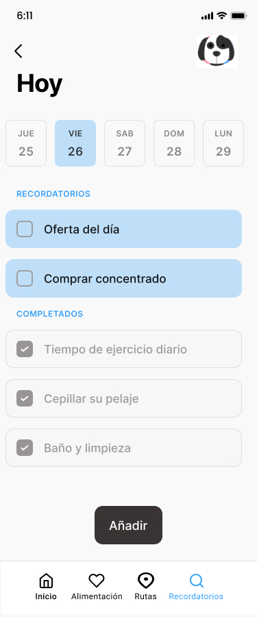

12. Pantalla 12: Control de Alimentacion

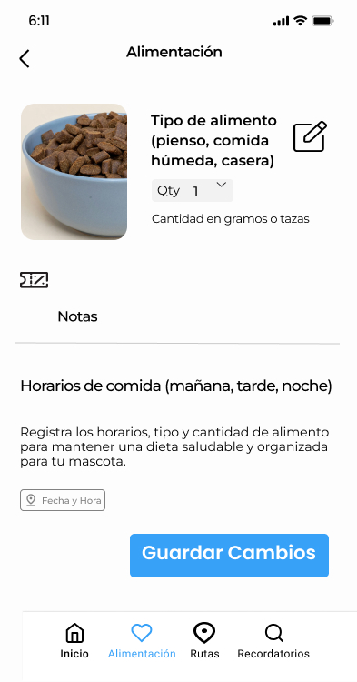

13. Pantalla 13: Veterinarias Cercanas

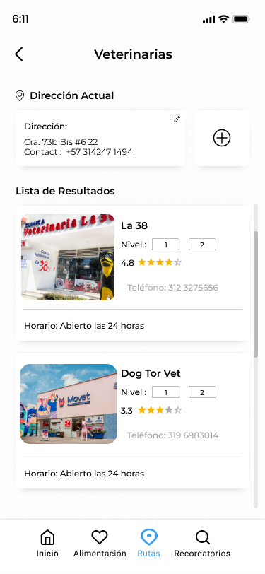

# Referencias

- [Material Design: Foundations](https://m3.material.io/foundations)
- [Material Design: Style](https://m3.material.io/styles)
- [Figma](https://www.figma.com/proto/H7i2oR6mBHplT9jN7KlP5K/Proyecto-Android--Actualizado-?node-id=2102-5&t=oGC1jv8xBZ9jyofL-1&scaling=min-zoom&content-scaling=fixed&page-id=0%3A1)
